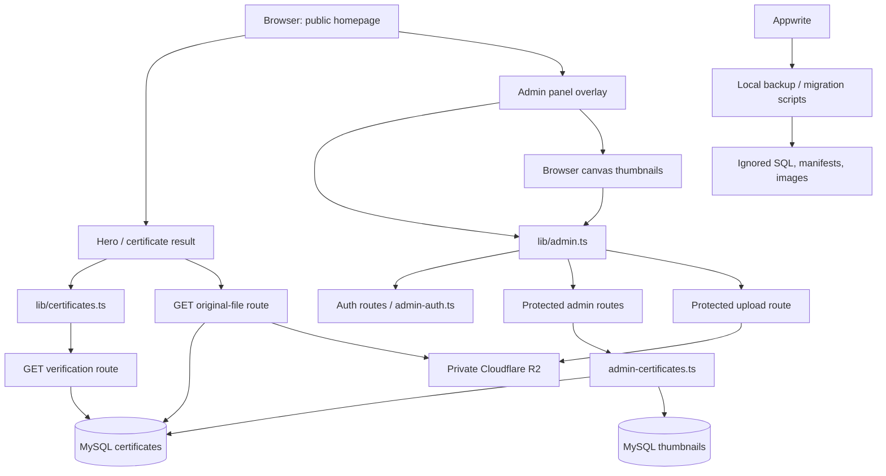
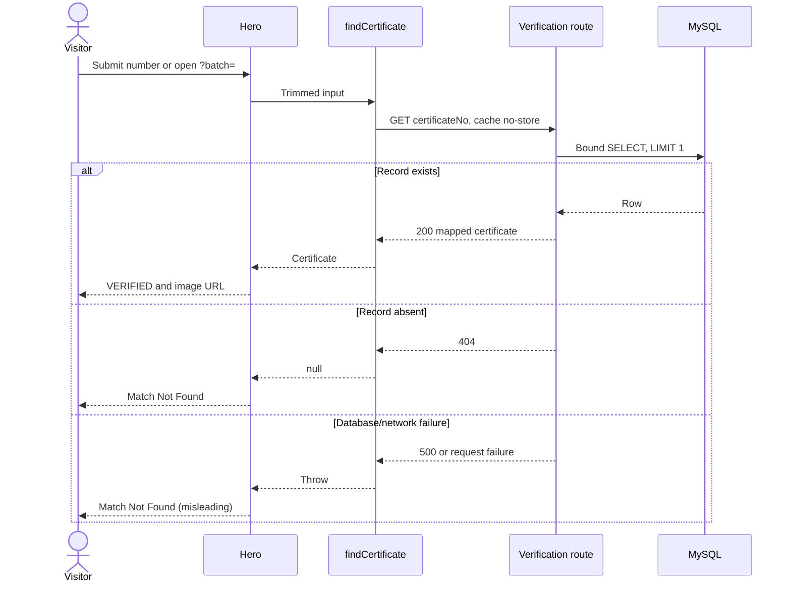
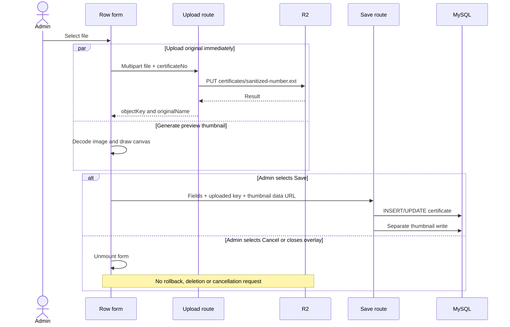
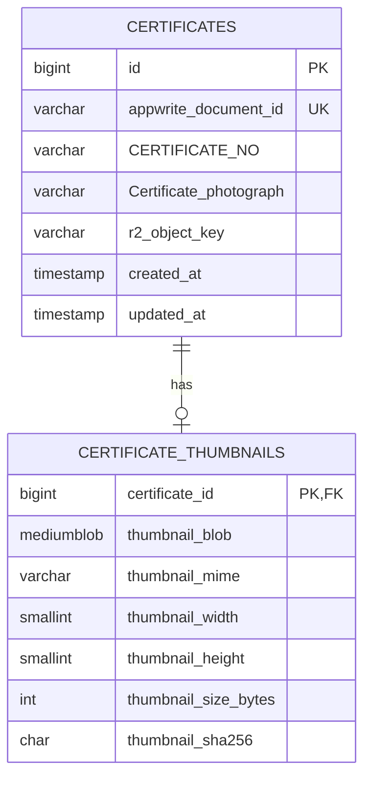

# Global Lab — architecture audit and improvement register

Audit date: **2026-10-02, Asia/Kolkata**. Baseline commit: `9885912fceb03559ff27c1abd14782bdece32d6f`, checked out on `main`.

This is the single working document for the reconnaissance, subsequent findings, verification gaps, and implementation backlog. Update findings here rather than creating parallel reports. No application changes are included in this audit. The pre-existing modification to `next-env.d.ts` was preserved.

**Start implementation with [section 13.1 — Recommended pickup order](#131-recommended-pickup-order).** Task IDs identify work; their numeric IDs are not execution priority.

## 1. Scope, evidence, and status

Evidence labels used throughout:

- **Source-confirmed:** traced in the current checkout; does not establish deployed behavior.
- **Reproduced:** executed against the actual source with synthetic inputs and mocked database/R2 boundaries. No real uploads or database mutations.
- **Local database verified:** read-only transaction against the loopback MySQL connection configured locally; metadata and aggregate counts only.
- **Historical documentation:** a prior report, not a new verification.
- **Needs verification:** unresolved external state or product decision. It must not be silently treated as fact.

All seven requested investigations have source coverage. Production reconciliation remains explicitly incomplete because no deployed URL or production database connection was established. Local verification is not production verification.

| Investigation | Result | Evidence in this document |
|---|---|---|
| Public verification, files, failure and caching | Traced; selected failures reproduced | Sections 3, 8 |
| Admin CRUD, CSV, upload and cancellation | Traced; parser and upload issues reproduced | Sections 4, 8 |
| Persistence rules and thumbnail consistency | Traced; local schema/counts checked; partial failure reproduced with mocks | Sections 5, 8 |
| Authentication, validation and public exposure | Traced; session/exposure behavior reproduced | Sections 6, 8 |
| Dependencies and migration compatibility | Static import graph and call-site inspection | Section 7 |
| Documentation versus deployed environment/schema | Local comparison complete; production evidence missing | Section 9 |
| Type-check, lint, test and build baselines | Executed; results and limitations recorded | Section 10 |

### Main conclusion

This is a small Next.js application that can be improved incrementally. It does not need a service split or a rewrite. Its main risks are certificate/file integrity, weak boundary validation, and absent regression gates—not circular dependencies or a complex distributed backend.

The highest-priority behavior is image replacement: selecting a file uploads it immediately to a key derived from the certificate number. Replacing the same extension can overwrite the existing original before Save; Cancel only closes the form. Other confirmed problems include incorrect CSV parsing, non-unique certificate numbers, independent certificate/thumbnail writes, and accepting arbitrary uploaded content types.

## 2. Reconnaissance carried forward

### Stack and runtime

- TypeScript/TSX application; JavaScript `.mjs` operational scripts.
- Next.js App Router with Node.js Route Handlers; React client components for interactive workflows.
- Lockfile versions: Next.js 16.3.6, React/React DOM 19.2.7, TypeScript 5.7.3, Tailwind 4.3.2, mysql2 3.24.5. These describe the checkout, not production.
- npm and `package-lock.json`; build command `next build --webpack`.
- Tailwind/PostCSS, Lucide, Base UI, shadcn configuration, class-variance-authority and CSS utility helpers.
- Handwritten SQL through `mysql2/promise`, a lazily created process-local connection pool; no ORM.
- Custom single-admin cookie authentication. MySQL holds certificates and thumbnails; private R2 holds originals.
- Vercel Analytics is mounted only in production. Fonts use `next/font/google`.
- No tracked test framework/suite, CI workflow, container or infrastructure-as-code configuration, queue, worker, scheduler, webhook, global state store, or server actions were found.
- `vercel.json` remains, while hosting documentation identifies Hostinger. No Node version pin, `.env.example`, or unified environment schema was found.

Sources: [package.json](../package.json), [lockfile](../package-lock.json), [layout](../app/layout.tsx), [MySQL pool](../lib/mysql.ts), [Next config](../next.config.mjs), [hosting notes](hosting-environment.md).

### Repository map

```text
app/
  layout.tsx, page.tsx, globals.css   Homepage, global presentation, analytics
  api/certificates/                  Public verification and original delivery
  api/admin/                         Auth, record CRUD, attributes, thumbnails, upload
components/
  hero.tsx, certificate-result.tsx   Public verification UI
  admin-panel.tsx                    Login, dashboard, forms, CSV, thumbnail creation
  contact.tsx                       Contact UI; no actual delivery integration
  ui/button.tsx                     Currently unreferenced shared button
  ...                               Marketing and visual components
hooks/use-reveal.ts                  Intersection/scroll presentation behavior
lib/
  admin.ts, certificates.ts          Browser API clients
  admin-auth.ts                      Server cookie/credential implementation
  admin-certificates.ts              SQL, schema introspection, mapping, thumbnails
  mysql.ts, r2.ts                    Server connections and provider requests
  utils.ts                          Class-name helper
scripts/                            Appwrite export, migration, audit tooling
docs/                               Historical plans plus this live audit
public/                             Static site images/icons
backups/                            Ignored local data, generated SQL and manifests
security-reports/                   Ignored dependency-audit output
```

The single page route is `/`; `app/page.tsx:11–26` statically imports and mounts the admin panel. There is no dedicated `/admin` page or middleware. Admin authorization belongs to API handlers, not visibility of the floating button.



## 3. Public verification and file delivery

### Verification lifecycle

1. `Hero` keeps query/result/loading in local state. On mount, `?batch=...` starts verification; manual submission uses the same `runVerify` function (`components/hero.tsx:57–91`).
2. `findCertificate` trims input, returns early for blank input, URL-encodes the number and uses `fetch(..., { cache: 'no-store' })` (`lib/certificates.ts:7–24`).
3. `GET /api/certificates/verify` trims `certificateNo`; absent/blank input returns 400. It executes a bound SQL query, `SELECT * ... WHERE CERTIFICATE_NO = :certificateNo LIMIT 1` (`app/api/certificates/verify/route.ts:43–65`).
4. No match returns 404 with `{ certificate: null }`. A match is mapped to strings, omitting null values and a small set of internal fields. An image key becomes a same-origin image route URL. Any new non-hidden column is automatically public (`route.ts:7–40`).
5. SQL exceptions are logged and return a generic 500. The client converts 404 to `null`, but throws on other non-success responses. `Hero` catches those errors and still sets `not-found`.
6. A match updates local state and replaces the browser query string with `?batch=...`. `CertificateResult` labels every found record VERIFIED and dynamically displays its fields; there is no verified/revoked workflow state in the inspected schema (`components/certificate-result.tsx:41–71`).

The button is disabled during loading. There is no explicit request cancellation or stale-response guard. A failed later search leaves the prior successful URL in place because only a successful result updates history. These are source observations; browser race behavior was not reproduced.



### Original-file lifecycle and caching

`GET /api/certificates/[certificateNo]/image` parses and decodes the URL path manually, reads `r2_object_key` using another bound MySQL query, signs an R2 GET server-side, and streams the response body. It does not require the visitor to have performed verification first. Both metadata and originals are public to a caller who knows a certificate number; bucket privacy does not make this application route private.

| Condition | Current response / consequence |
|---|---|
| Missing number | 400 |
| No row or no object key | 404 |
| R2 non-success, including 403, 429 or 503 | 404, all treated as missing image |
| Thrown DB/network error | Logged, generic 500 |
| Success | Provider Content-Type (or extension fallback), streaming body, `public, max-age=3600` |
| Malformed encoded path | `decodeURIComponent` runs before the handler try/catch; error escapes its JSON error handling |

Source: [image route](../app/api/certificates/[certificateNo]/image/route.ts), lines 12–54; [R2 wrapper](../lib/r2.ts), lines 22–80.

No explicit runtime R2 timeout, retry, conditional request forwarding, Range forwarding, ETag forwarding or cache invalidation is implemented. The public URL remains the same after replacing the underlying object. Browser/intermediary caches may therefore serve an old original for up to the advertised hour, including after deletion. Admin thumbnails have `private, max-age=300` at a similarly stable URL. Actual CDN overrides and retention remain **Needs verification**.

Only the certificate client explicitly requests `no-store`; the metadata/auth/admin JSON handlers do not set their own cache policy. This report does not infer shared caching of those responses from missing headers. Deployment response headers should be checked.

The result component always renders a Next Image even though the backend can serve PDF. There is no image-error UI or PDF-specific preview; PDF support is inconsistent across the server, upload picker (`image/*`), and renderer.

## 4. Administration workflows and cancellation

### Session and initial data

On every homepage mount, `AdminPanel` requests `/api/admin/auth/me`. A valid user opens the dashboard immediately; otherwise a floating login button appears. That initial promise has no catch/finally: a network failure can leave `checking=true` and hide admin access. Login issues a cookie, then the UI makes a second `/me` request although login already returned a user. Logout clears the cookie before changing local state (`components/admin-panel.tsx:27–55`).

The dashboard fetches records and attributes concurrently. Attributes come from `SHOW COLUMNS`; records are the newest 500 with a thumbnail-existence join. Search filters only those loaded rows. A fetch failure is logged without a visible error; an initial failure can appear as an empty database (`components/admin-panel.tsx:204–225,303–309`; `lib/admin-certificates.ts:45–71`).

### Create, update, delete

| Action | Current chain and persistence |
|---|---|
| Create | Dynamic form → `createDocument` → protected POST → introspect columns → normalize allowed values → generate `admin-<uuid>` legacy ID → insert certificate → optionally upsert thumbnail → re-query and return 201 |
| Update | Form sends all its initialized editable fields, not just changed fields → protected PATCH → normalize → update certificate → separately upsert/delete thumbnail → re-query and return 200 |
| Delete | Browser confirmation → protected DELETE → delete certificate → FK cascades thumbnail deletion if deployed constraint exists → return `{ok:true}`; R2 object is not deleted |
| Unknown ID | PATCH may return 200 with `document:null`; DELETE reports success without checking affected rows |
| Successful form save | Close modal and re-fetch list/attributes |
| Save failure | Alert message; persistence may already have partially succeeded |

Sources: [admin client](../lib/admin.ts), [record operations](../lib/admin-certificates.ts), [ID route](../app/api/admin/certificates/[id]/route.ts), [form](../components/admin-panel.tsx), lines 525–599.

No optimistic concurrency check is made. Two tabs can overwrite each other's values because updates write the full form snapshot without comparing `updated_at` or a version.

### Upload and cancel — separate operations



- Selecting a replacement with the same number/extension reuses the original object key. Cancel cannot undo an already completed PUT. Different numbers such as `A/B` and `A-B` also collapse to one key.
- Closing the overlay, X, or Cancel remains available during upload/save. Unmounting has no AbortController and cannot be treated as canceling server work.
- The upload and thumbnail generation use `Promise.all`. A thumbnail decode failure can report “Image upload failed” even after R2 accepted the original.
- Removing the preview only sets `__removeImage`; R2 is never cleaned up. Changing number/extension or abandoning a new record can leave an orphan object.
- Preview object URLs allocated at `admin-panel.tsx:570` have no cleanup; the separate image-decoder helper does revoke its own temporary URL.

Sources: [upload route](../app/api/admin/upload/route.ts), lines 8–61; [form handlers](../components/admin-panel.tsx), lines 557–599, 603–684, 747–781.

### CSV import

`FileReader` loads the entire CSV, `parseCSV` parses it in the browser, and headers are matched case-insensitively to introspected database fields. Unknown headers are skipped; `Certificate_photograph` is intentionally excluded. Each row is posted sequentially through ordinary create. Failures increment a counter; the row identity and reason are discarded. No batch validation, idempotency, transaction, row limit or resumable checkpoint exists.

The first parsing pass strips quotation marks before the comma-splitting pass. Reproduction: `AUDIT-1,"red, blue",gem` produces four fields, not three; header mapping can store `blue` as category and discard the intended `gem`. Doubled quotes are also lost. This is silent data corruption, not just unsupported formatting.

The footer Close button is disabled during import, but overlay and X still close the modal. The loop continues in the mounted RowsTab; closing the modal does not stop or roll back the import. Re-importing successful rows creates additional records because neither idempotency nor number uniqueness prevents it.

Sources: [admin-panel.tsx](../components/admin-panel.tsx), lines 240–300, 416–491, 694–745.

## 5. Persistence rules: implemented versus intended

### Model



Certificate attributes include category/product, measurements, appearance, material/treatment/origin, rudraksha, botanical and gem properties. They are mostly nullable strings; even `CERTIFICATE_DATE` is a varchar. Numeric/date semantics are not enforced by application validation.

| Rule | Current implementation |
|---|---|
| Identity | MySQL auto-increment ID; API also aliases it as `$id` |
| Certificate number | NOT NULL varchar(64), **non-unique** index; input trimmed on normal writes/lookups |
| Legacy ID | Required unique varchar(64); generated for new admin rows; still editable by crafted PATCH |
| Thumbnail relationship | Optional one-to-one; FK delete cascade confirmed locally |
| Editable fields | Derived from database columns; unknown fields silently ignored, values coerced to strings/null |
| Required/length checks | HTML `required` in form; no complete server schema; database errors often become 500 |
| Record + thumbnail atomicity | Separate pool statements, no transaction |
| Concurrency | No expected version or conditional update |
| R2 reference integrity | Save accepts a client-supplied nonempty `objectKey`; no existence or upload-ownership check |
| Thumbnail validity | Regex and decoded-byte ceiling of 25,000; dimensions/MIME/content not decoded or verified |
| Thumbnail rejection | Invalid/oversized thumbnail returns null silently; save can still succeed |
| Image replaced without thumbnail | Existing thumbnail can remain for the old image |
| Original lifecycle | No R2 deletion, reference count or compensation |

Parameterized values and SQL identifier escaping are present; no runtime SQL-injection path was established in the inspected operations. That does not replace input and business validation.

Sources at audit time included the migration schema generator, later retired on
2026-10-03 after successful migration, and
[record library](../lib/admin-certificates.ts), lines 74–134,168–204,226–294.

### Local database evidence

The configured host is loopback/local. The connection was inspected using `SET SESSION TRANSACTION READ ONLY`, a transaction, SELECT/information_schema queries, then rollback. No credentials, record contents, original images or thumbnail bytes were printed.

| Check | Observed |
|---|---:|
| Certificates | 212 |
| Thumbnails | 212 |
| Duplicate certificate-number groups, using database comparison | 0 |
| Certificates without thumbnails | 0 |
| Orphan thumbnails | 0 |
| Certificates without R2 object keys | 0 |

Column names/types/nullability, indexes and the cascade relationship agree with the generated schema in the inspected dimensions. `idx_certificate_no` is explicitly NON_UNIQUE=1. Zero current duplicates does not provide a future uniqueness guarantee. This check does not prove R2 object existence, thumbnail/original correspondence, or production equality.

## 6. Authentication, authorization and exposure

`lib/admin-auth.ts` checks one normalized environment email against a password hash. Supported formats are raw/prefixed SHA-256 and salted scrypt. The local configured format is legacy SHA-256; the value is not recorded. **Needs verification:** production hash format and key strength.

Sessions are signed base64url JSON containing email, millisecond expiry and a random nonce. They use HMAC-SHA256 and timing-safe signature comparison. The cookie lasts eight hours, is HttpOnly, SameSite=Strict, path `/`, and Secure in production. The payload is signed, not encrypted. No browser localStorage token is used.

All certificate administration, attributes, thumbnail and upload handlers explicitly call `requireAdmin`. Login is public, `/me` returns user-or-null, and logout expires the browser cookie. Public certificate metadata and original-file routes intentionally have no admin guard. No missing guard was found on the inspected admin mutation routes.

The nonce is not stored or checked server-side. Logout does not revoke a copied token. Changing ADMIN_EMAIL or ADMIN_PASSWORD_HASH does not invalidate one either: validation checks signature and expiry, but not the configured identity. Rotating SESSION_SECRET invalidates existing tokens. These behaviors were reproduced with synthetic credentials.

No application login throttle, lockout, explicit Origin check or CSRF token was found. SameSite=Strict is an existing mitigation; absence of a CSRF token alone is not proof of exploitable CSRF. Host-level WAF/rate-limit rules and proxy behavior are **Needs verification**.

Upload authentication is enforced, but validation only checks `instanceof File`. Unknown extensions fall back to `.jpg`; the untrusted `file.type` is sent to R2. The public delivery route reuses that Content-Type. An authenticated upload of benign text with `text/html` was accepted in the mocked check, establishing a same-origin active-content risk; no malicious payload was uploaded to a live service.

Save also trusts uploaded object keys and client-produced thumbnail metadata. Public metadata uses a denylist rather than an explicit public field contract. Admin create/update/upload errors may return raw exception messages. No unsafe redirect or `dangerouslySetInnerHTML` path was found in the reviewed workflows.

## 7. Module dependencies and migration compatibility

A TypeScript-AST scan of static local imports in `app`, `components`, `hooks` and `lib` found **35 modules, 44 local import edges, one type-only import, and no cycles**. This result excludes package internals, HTTP links, dynamic dependencies and operational scripts.

| Module | Responsibility | Depends on / called by | Boundary or maintenance issue |
|---|---|---|---|
| `app/page.tsx` | Compose the entire homepage | Marketing components and AdminPanel | Public page owns admin mounting |
| `components/hero.tsx` | Search and result state | certificates client, result component | Errors collapsed into not-found |
| `components/admin-panel.tsx` | Auth UI, rows, forms, CSV, canvas | admin client | Large component; unrelated responsibilities and untyped records |
| `lib/admin.ts` | Browser JSON/multipart requests | AdminPanel | Legacy vocabulary |
| `lib/certificates.ts` | Public browser request and type | Hero; type imported by result | Index signature permits arbitrary fields |
| Public API routes | Validate minimal input, query/map/stream | mysql and R2 | SQL/mapping in route; metadata exposure policy tied to schema |
| Admin API routes | Guard and HTTP transport | auth, record library, R2 | Repeated error/ID parsing; raw error leakage in some handlers |
| `lib/admin-certificates.ts` | SQL, introspection, normalization, mapping, thumbnails | Four route modules; mysql | Multiple persistence/business responsibilities, no atomic save |
| `lib/admin-auth.ts` | Credentials/cookies/token verification | Eight auth/admin route modules | Stateless revocation limitations; duplicated env reader |
| `lib/mysql.ts` | Lazy connection pool | Public routes and record library | Per-process limit defaults to 10; fleet sizing/TLS needs verification |
| `lib/r2.ts` | Provider calls, signing, content-type fallback | Upload and original route | Manual signing, no explicit deadline/retry policy |
| `lib/utils.ts`, reveal hook/components | Shared styling/presentation | Presentation modules | Small, coherent abstractions; no reason to generalize further |
| Migration scripts | Export, generate SQL/images/manifests, upload, validate | Appwrite, filesystem, crypto, macOS sips | Operational compatibility, duplicated key/signing helpers, hard-coded default snapshot |

No browser module directly imports MySQL or the R2 server implementation. Client/server helpers do share `lib/`, and no explicit `server-only` import guard was found. Important chains are `Hero → client → public route → SQL`, and `AdminPanel → admin client → protected route → record library → SQL`. Thumbnail encoding and CSV-to-record mapping live in UI code.

### What can and cannot be removed yet

| Compatibility item | Current consumer / decision |
|---|---|
| Appwrite SDK | Imported by export script only; not runtime. Keep until backup/rollback requirements are resolved, or intentionally retire that script and dependency together. |
| Appwrite environment names/API key | Used by export tooling. No observed runtime need; do not delete without deciding operational retention. |
| `appwrite_document_id` | Required unique DB column; creation generates it; migration uses it to resolve thumbnail foreign keys. Removing it alone breaks writes/import. |
| `$id` alias | Used by React row keys, edit/delete calls and admin documents. Keep until callers change together. |
| `documents` / `attributes` response names | Consumed by admin client and dynamic forms. Cosmetic naming cleanup must preserve contracts during migration. |
| `Certificate_photograph` | Drives field-specific upload UI, image labels and public mapped URL. Not dead despite different legacy/current meaning. |
| Legacy timestamps | Preserved provenance; runtime can omit them from public responses. Retention decision precedes deletion. |
| Removed T21 dead code | Throwing column wrappers, unused button module and old Hero commented implementation were removed after confirming no static callers. |
| `vercel.json` | Production platform is not established by this file. Remove only after deployment ownership is confirmed. |
| MySQL/R2 generation and validation scripts | Retired on 2026-10-03 after owner confirmed migration completion. Ignored local backups remain retained outside Git. |

Duplicated implementations worth comparing originally included script/runtime R2
signing and object-key construction. The one-off migration scripts were retired
after migration completion; runtime helper cleanup should now stay focused on
live modules and tests.

## 8. Findings register

All findings below are **Open**. Severity describes the consequence of the implemented behavior, not proof of an incident in production. Critical = serious data integrity/security/reliability risk; High = substantial correctness/security/engineering risk; Medium = meaningful debt or operational limitation; Low = localized cleanup. Root causes are architectural interpretations, not claims about author intent. No finding assumes code is defective because it was AI-assisted.

| ID | Severity | Finding | Evidence level |
|---|---|---|---|
| A01 | Critical | Upload can replace an existing original before Save/after Cancel | Source + reproduction |
| A02 | High | CSV parser silently corrupts quoted values | Reproduced |
| A03 | High | Certificate-number uniqueness is not enforced | Source + local schema |
| A04 | High | Certificate and thumbnail changes can partially commit | Source + reproduction |
| A05 | High | Arbitrary upload content can be served on the application origin | Source + reproduction |
| A06 | High | Login lacks application throttling; local password hash is legacy SHA-256 | Source + local config classification |
| A07 | High | New database fields become public automatically | Reproduced |
| A08 | High | Mutation contracts trust/coerce client data and object references | Source + reproduction |
| A09 | High | Type/lint/test gates do not protect changes | Executed baselines |
| A10 | Medium | Logout/credential change does not revoke existing sessions | Reproduced |
| A11 | Medium | Stable cached URLs can show stale/deleted originals and thumbnails | Source; cache effect inferred |
| A12 | Medium | Thumbnail metadata/content can be invalid or stale | Reproduced |
| A13 | Medium | CSV import has partial progress without idempotency or useful failure recovery | Source |
| A14 | Medium | Admin listing silently stops at 500; search is incomplete | Source |
| A15 | Medium | Error handling hides outages, leaks internals, or leaves UI stuck | Source + reproduction |
| A16 | Medium | Concurrent edits overwrite newer values | Source; multi-client scenario inferred |
| A17 | Medium | Live deployment and operational configuration are not reproducibly established | Documentation/config comparison |
| A18 | Medium | Migration/schema ownership depends on ignored local artifacts | Source + artifact validation |
| A19 | Medium | Contact success is shown without sending the enquiry | Source |
| A20 | Medium | Admin UI and schema introspection couple unrelated responsibilities | Source + dependency scan |
| A21 | Low | Dead wrappers, unused UI primitive, comments and duplicated helpers add noise | Static call-site scan |
| A22 | Medium | Provider requests have no explicit deadlines or useful failure distinction | Source + reproduction |

### A01 — Upload before Save can overwrite a valid certificate original

- **Current behavior / problem:** selecting a file writes immediately to `certificates/<sanitized-number>.<ext>`. Same-number replacements reuse the key; `A/B` and `A-B` also collide. Cancel closes the form without reversing the write.
- **Evidence:** `app/api/admin/upload/route.ts:22–25,42–61`; `components/admin-panel.tsx:557–575,603–612,670–676`. Synthetic PUT stubs confirmed repeated and colliding keys without any save call.
- **Impact:** an abandoned or failed edit can change the original served for an existing record while metadata/thumbnail remain old. Original recovery depends on external backups; provider recovery/versioning was not verified.
- **Likely root cause:** human-facing certificate identity is reused as mutable object identity; upload completion is treated as a preview step.
- **Recommendation:** upload to a unique immutable key; save explicitly attaches a validated upload reference. Keep the old reference until save commits. Add cleanup for unattached objects only after reference checks and retention policy. Preserve existing keys during rollout.
- **Migration difficulty:** Medium. **Risk of changing:** High, because existing references and originals must remain readable.

### A02 — CSV quoting is destroyed before fields are split

- **Current behavior / problem:** the first pass removes quotes; the second pass then splits commas without knowing which were quoted. Escaped quotes are lost.
- **Evidence:** `components/admin-panel.tsx:694–745`; synthetic quoted-comma and doubled-quote inputs reproduced both errors. Row mapping at lines 268–276 silently drops surplus fields.
- **Impact:** plausible-looking records can contain values under the wrong field names.
- **Likely root cause:** two independent parsing passes implement inconsistent CSV rules without fixtures.
- **Recommendation:** use a tested CSV parser or one consistent implementation with quoted commas, escaped quotes, multiline fields, BOM, CRLF and mismatched-width fixtures; preview and reject invalid rows before mutation.
- **Migration difficulty:** Low. **Risk of changing:** Medium; compare representative existing imports and preserve intended trimming/header matching.

### A03 — Public identity is not unique

- **Current behavior / problem:** certificate number has a normal index, while both public queries use `LIMIT 1` without duplicate detection. Each create generates a new unique legacy ID, so that constraint does not deduplicate certificate numbers.
- **Evidence:** retired migration import SQL recorded the non-unique certificate-number index; public routes at `verify/route.ts:51–53` and `[certificateNo]/image/route.ts:30–32`; local information_schema confirmed the non-unique index.
- **Impact:** duplicate creates/import retries can make verification ambiguous; separate metadata/image queries are not guaranteed to choose the same duplicate row.
- **Likely root cause:** migration preserved historical row identity without enforcing the application's lookup identity.
- **Recommendation:** confirm case/whitespace and revocation/reissue rules, audit duplicates using production collation, resolve conflicts explicitly, then add a versioned unique constraint and return a meaningful 409 on conflicts. Do not automatically delete duplicates.
- **Migration difficulty:** Medium. **Risk of changing:** High due to existing data and externally shared certificate numbers.

### A04 — Multi-statement saves are not atomic

- **Current behavior / problem:** certificate insert/update and thumbnail write/delete run independently on the pool; thumbnail failure can follow a committed record mutation. R2 upload precedes both.
- **Evidence:** `lib/admin-certificates.ts:74–130`; a throwing thumbnail stub demonstrated certificate insert precedes failure with no transaction API invocation.
- **Impact:** API failure can coexist with a created/modified record; retry can duplicate a create. Metadata, original and preview can disagree.
- **Likely root cause:** persistence helpers were composed as separate statements, without a defined save boundary.
- **Recommendation:** validate before writing; use one acquired connection and transaction for certificate/thumbnail changes. Coordinate R2 through unique staged uploads and explicit attachment, not a fictitious cross-provider SQL transaction.
- **Migration difficulty:** Medium. **Risk of changing:** Medium; cover failure/rollback and existing thumbnail optionality.

### A05 — Upload type/size controls are missing

- **Current behavior / problem:** File presence is the only main guard; arbitrary content type is forwarded, unknown extension falls back to JPEG, and the whole body is buffered. Original delivery preserves the R2 type on the application origin.
- **Evidence:** `app/api/admin/upload/route.ts:13–25,52–61`; image route lines 46–49; synthetic `text/html` upload returned 200 and was passed through to the R2 mock with that MIME type.
- **Impact:** an authenticated uploader can store active content for public same-origin delivery; oversized input can exhaust application memory. This is not an unauthenticated upload bypass.
- **Likely root cause:** browser picker restrictions were treated as validation, and storage metadata was trusted on read.
- **Recommendation:** define an actual image/PDF policy, enforce byte limits before full buffering where possible, verify file signatures/decoded image limits, and set deliberate response content types/disposition and `nosniff`. Decide PDF rendering policy explicitly.
- **Migration difficulty:** Medium. **Risk of changing:** Medium; existing PDFs/images may need compatibility handling.

### A06 — Login protection is incomplete

- **Current behavior / problem:** no route-level throttle; password verification accepts unsalted fast SHA-256. Local configuration uses that legacy format. scrypt support already exists.
- **Evidence:** `app/api/admin/auth/login/route.ts:6–19`; `lib/admin-auth.ts:73–111`; local value classified without recording it. Production-follow-up already acknowledges both issues.
- **Impact:** online guessing lacks an application limit; a leaked legacy hash is cheaper to attack offline. Production exposure depends on actual hash format and external controls.
- **Likely root cause:** a single-admin migration optimized initial access over complete credential lifecycle controls.
- **Recommendation:** migrate the configured password to scrypt with a documented compatible parameter format; stop accepting legacy formats after migration. Apply bounded per-account/per-client throttling appropriate to the actual hosting topology, with generic errors and tests. Do not rely only on per-process counters across multiple workers.
- **Migration difficulty:** Medium. **Risk of changing:** Medium; test recovery and avoid accidental admin lockout.

### A07 — Database growth can expand public disclosure

- **Current behavior / problem:** the public mapper exposes every non-null column except a denylist, and the result UI renders arbitrary fields.
- **Evidence:** `app/api/certificates/verify/route.ts:7–40`; `components/certificate-result.tsx:41–54`; a synthetic additional internal-note column appeared in the public response.
- **Impact:** adding an internal field later can disclose it without a deliberate API/UI change. Current COMMENTS or other business fields require an explicit public-data decision; sensitive contents were not inspected.
- **Likely root cause:** dynamic Appwrite-era document display was carried into SQL mapping.
- **Recommendation:** define and test an explicit public certificate projection after agreeing which existing fields must remain visible. Keep admin-only fields outside that contract.
- **Migration difficulty:** Low. **Risk of changing:** Medium because existing consumers may depend on current fields.

### A08 — Server mutation contracts do not enforce business input

- **Current behavior / problem:** arbitrary values are stringified; unknown fields ignored; raw object keys are accepted; `appwrite_document_id` is reintroduced into editable columns despite being hidden from the form. Required/length rules mostly depend on DB errors.
- **Evidence:** `lib/admin-certificates.ts:168–204,226–235`; synthetic PATCH changed the legacy ID. Upload/record bodies lack a complete object schema.
- **Impact:** invalid records, forged/stale file references, broken provenance and confusing 500 responses. Authentication limits this to admin-capable callers but does not prevent accidental misuse.
- **Likely root cause:** schema introspection doubles as a business contract and compatibility fields escape the UI denylist.
- **Recommendation:** explicit create/update contracts, finite number/length/type constraints, immutable system fields, and validated upload attachment records. Distinguish invalid input (400/422), conflict (409) and missing row (404).
- **Migration difficulty:** Medium. **Risk of changing:** Medium; preserve allowed empty/null behavior deliberately.

### A09 — The checkout lacks effective correctness gates

- **Current behavior / problem:** two type errors exist; Next builds ignore type errors; lint cannot run; no test script/framework or tracked CI exists.
- **Evidence:** `next.config.mjs:3–4`; `components/sample-reports.tsx:71`; `package.json:5–18`; executed checks in section 10.
- **Impact:** build success does not establish type safety, and critical import/auth/file behavior can regress unnoticed.
- **Likely root cause:** delivery scripts accumulated without an enforced quality baseline.
- **Recommendation:** fix the two concrete errors, establish a clean lint/type command, add focused behavioral tests for A01–A08, and enforce them in CI. Remove `ignoreBuildErrors` only after the check is clean.
- **Migration difficulty:** Medium. **Risk of changing:** Low for initial baseline repair; isolate broad lint cleanup.

### A10 — Sessions survive logout and credential replacement

- **Current behavior / problem:** logout expires only the caller's cookie. Stored/copied tokens remain valid until expiry or signing-secret rotation; configured identity/password changes are not checked.
- **Evidence:** `lib/admin-auth.ts:25–41,61–69`; synthetic logout and identity/password replacement left the original token accepted, while secret rotation rejected it.
- **Impact:** an administrator cannot revoke a lost session by logout or password change alone. Eight-hour expiry limits duration.
- **Likely root cause:** stateless signed cookies have no revocation/version check; nonce is informational.
- **Recommendation:** define revocation requirements for this one-admin product. A documented session-version check/rotation may suffice; use a session table only if individual session revocation is required. Check the configured identity and validate payload shape.
- **Migration difficulty:** Low–Medium. **Risk of changing:** Medium; existing sessions may intentionally be logged out.

### A11 — Cache keys do not change with file content

- **Current behavior / problem:** one-hour public originals and five-minute private thumbnails use stable certificate URLs; mutation does not change the URL or invalidate caches.
- **Evidence:** image route lines 46–49; thumbnail route lines 19–24; `lib/admin-certificates.ts:216–220`.
- **Impact:** previews/originals can be stale after replacement; deletion cannot retract already cached content. Host CDN behavior is unverified.
- **Likely root cause:** caching was added independently of content identity and mutation semantics.
- **Recommendation:** decide whether revocation/deletion needs immediate visibility. Introduce content-versioned URLs for immutable originals or a suitably conservative revalidation policy; ensure versioned reads bind to that version. Test replacements through real deployed caches.
- **Migration difficulty:** Medium. **Risk of changing:** Medium for performance and existing shared URLs.

### A12 — Thumbnail consistency is only partially enforced

- **Current behavior / problem:** parser trusts MIME/dimensions and does not decode bytes; invalid thumbnails silently disappear. Replacing an original without a valid new thumbnail can preserve the old preview.
- **Evidence:** `lib/admin-certificates.ts:124–127,238–280`; synthetic one-byte JPEG with 999×999 metadata accepted; replacement without thumbnail emitted no thumbnail write/delete.
- **Impact:** misleading previews, inconsistent metadata, and silent failures despite successful saves.
- **Likely root cause:** client-generated derived data is treated as trusted persistence input.
- **Recommendation:** validate/decode or generate thumbnails server-side behind a small image module, enforce limits, define PDF/no-thumbnail behavior, and clear/regenerate preview when original changes within the SQL save transaction.
- **Migration difficulty:** Medium. **Risk of changing:** Medium for runtime image-library support and old records.

### A13 — CSV retries and cancellation have no defined guarantees

- **Current behavior / problem:** sequential creates commit independently; failures retain counts only. Closing overlay/X does not cancel the loop. Re-import repeats successes.
- **Evidence:** `components/admin-panel.tsx:258–289,419–422,475–489`.
- **Impact:** partial and duplicate imports are difficult to repair; users may believe closed UI stopped mutation.
- **Likely root cause:** bulk import is implemented as a browser loop over a single-record endpoint.
- **Recommendation:** first add preflight validation, row-specific errors, bounded size and clear stop semantics. Add stable idempotency/conflict handling; stop after the current request if cancellation is requested. A background queue is not justified at current size without measured demand.
- **Migration difficulty:** Medium. **Risk of changing:** Medium; document partial-success behavior rather than implying all-or-nothing.

### A14 — Admin search is limited to the newest 500 records

- **Current behavior / problem:** fixed LIMIT 500, no total or pagination; local search and displayed row count imply completeness.
- **Evidence:** `lib/admin-certificates.ts:45–57`; `components/admin-panel.tsx:303–309,414`.
- **Impact:** older records become undiscoverable through admin UI after growth. Current local count is 212, so truncation is not currently reached there.
- **Likely root cause:** a temporary dataset-size assumption became an API contract.
- **Recommendation:** bounded server pagination/search, deterministic tie-breaker ordering and explicit total/filter counts. Index changes should follow query plans and measured data.
- **Migration difficulty:** Medium. **Risk of changing:** Low–Medium.

### A15 — Failure responses and UI states are inconsistent

- **Current behavior / problem:** database/network errors become public not-found; admin bootstrap can stay hidden on rejection; list errors can look empty; create/update/upload may expose raw exception messages; missing IDs can return successful responses.
- **Evidence:** `components/hero.tsx:81–84`; `components/admin-panel.tsx:32–40,204–225`; admin create route lines 27–29, ID route lines 18–20, upload route lines 36–38; `lib/admin-certificates.ts:130–134`.
- **Impact:** users act on false information, support loses diagnostic context, and internal SQL/provider details may escape.
- **Likely root cause:** each route/UI developed its own catch/response convention.
- **Recommendation:** a small shared error vocabulary and response mapper, stable safe client messages, request IDs in server logs, explicit unavailable/not-found/empty states, and affected-row checks. Do not build a generic exception framework.
- **Migration difficulty:** Medium. **Risk of changing:** Low–Medium; characterize current clients first.

### A16 — Full-form updates allow lost edits

- **Current behavior / problem:** each edit initializes all fields and sends them back, with an unconditional `WHERE id = :id` update.
- **Evidence:** `components/admin-panel.tsx:536–542,583–594`; `lib/admin-certificates.ts:115–120`.
- **Impact:** two tabs or concurrent requests can overwrite changes invisibly, even with only one admin account.
- **Likely root cause:** last-write-wins is implicit rather than a stated business decision.
- **Recommendation:** use an expected revision/updated-at token and return a conflict when it changed; preserve local form data for resolution. Sending only changed fields reduces but does not eliminate conflicts.
- **Migration difficulty:** Medium. **Risk of changing:** Medium; timestamp precision/version choice needs a migration decision.

### A17 — Deployment evidence and configuration ownership are incomplete

- **Current behavior / problem:** docs mix completed imports, future environment setup and historical smoke tests; checkout is on main while migration notes describe a custom branch. Hostinger notes coexist with Vercel config. No runtime version pin or tracked deploy gate.
- **Evidence:** `docs/migration-plan.md:335–355,417–433,465–471,543–609`; `vercel.json`; package/config inventory; current Git branch.
- **Impact:** local success can be mistaken for production success, and deploy/rollback procedures are difficult to reproduce.
- **Likely root cause:** session notes evolved into operational documentation without dated deployment records.
- **Recommendation:** record deployed URL/revision/runtime, environment-variable names and ownership, database migration version, smoke results and rollback steps. Verify TLS/pool sizing/proxy controls against the real deployment. Keep values out of Git.
- **Migration difficulty:** Low. **Risk of changing:** Low for documentation; separately assess deployment changes.

### A18 — Recreating schema depends on a local backup snapshot

- **Current behavior / problem:** schema SQL is generated from ignored backup data/schema with a hard-coded default snapshot; lengths are inferred from data. Plain inserts are not resumable. Thumbnail generation requires macOS `sips`. Validator checks artifact consistency, not a live production migration.
- **Evidence:** retired migration generation tooling previously depended on ignored backup data/schema and macOS thumbnail tooling; `.gitignore:13–15`; migration artifact validation output recorded in this audit.
- **Impact:** a fresh checkout cannot reproduce deployment from tracked files alone; interrupted/repeated imports need operator care. The validator prints duplicate/review counts but those counts alone are not added to its errors list.
- **Likely root cause:** one-time migration tooling also serves as the long-term schema source.
- **Recommendation:** establish a sanitized tracked schema baseline and ordered migrations; retain protected backups separately with restore instructions. Define duplicate/review validation policy and resume behavior. Make image tooling portable only if non-macOS execution is required.
- **Migration difficulty:** Medium. **Risk of changing:** High if legacy data/import behavior is changed without reconciliation.

### A19 — Contact submission reports success without delivery

- **Current behavior / problem:** submit only calls `setSent(true)` and resets it four seconds later; no request/storage/email exists.
- **Evidence:** `components/contact.tsx:19–23`.
- **Impact:** visitors can reasonably believe an enquiry reached the laboratory when it did not.
- **Likely root cause:** presentation placeholder was left as a functional-looking form.
- **Recommendation:** choose a real contact delivery workflow with failure handling, or replace the form with an honest direct contact action. Do not add an email service before the product choice.
- **Migration difficulty:** Low for truthful UI; Medium for delivery integration. **Risk of changing:** Low.

### A20 — Admin responsibilities and contracts are overly coupled

- **Current behavior / problem:** one component owns auth, CRUD, parsing/import, validation state and image transformation. Database introspection controls both field editing and write acceptance. Many API records use `any`.
- **Evidence:** `components/admin-panel.tsx:27,188,525,694,747`; `lib/admin.ts:47–77`; `lib/admin-certificates.ts:60–71,168–186`.
- **Impact:** behavior is harder to test independently and schema changes propagate unexpectedly across UI/API/persistence.
- **Likely root cause:** features were expanded within an existing panel and legacy dynamic-schema contract.
- **Recommendation:** extract pure CSV/thumbnail logic and typed contracts first; then split the existing panel by behavior while keeping the API stable. Introduce one certificate use-case module and predictable SQL ownership, not a generic repository/DI framework.
- **Migration difficulty:** Medium. **Risk of changing:** Medium; perform after characterization tests.

### A21 — Small cleanup opportunities obscure active behavior

- **Current behavior / problem:** repeated types/env/key/signing helpers remain, but the confirmed local dead code/resource leak items have been cleaned up in T21.
- **Evidence:** T21 removed unreferenced column wrappers, the unused button module and obsolete Hero comments, and added admin preview object URL cleanup. Remaining duplication is script/runtime helper overlap from section 7.
- **Impact:** maintainers have less legacy UI/client noise; remaining duplicated operational helpers can still confuse ownership if retired without a V08 decision.
- **Likely root cause:** old implementation paths were retained after migration and helpers evolved independently.
- **Recommendation:** preserve operational scripts and contracts listed as necessary in section 7. Share only concepts with real common semantics, and do not retire backup/migration helpers without V08.
- **Migration difficulty:** Low. **Risk of changing:** Low after checking consumers; do not infer unused packages solely from one component.

### A22 — Provider failures have no bounded runtime policy

- **Current behavior / problem:** R2 fetch/put has no application deadline or explicit retry strategy; original delivery maps every non-success status to 404. Pool waits also have no explicitly configured queue bound in the application.
- **Evidence:** `lib/r2.ts:22–62`; image route lines 40–43; `lib/mysql.ts:21–24`; R2 503→404 reproduced.
- **Impact:** upstream incidents look like invalid certificates/files and can occupy request resources for provider/framework-dependent durations.
- **Likely root cause:** fetch primitives are used without an application reliability contract.
- **Recommendation:** bounded timeouts, distinguish not-found from upstream failure, safe transient-read retry limits, and observable provider status without exposing bodies. Do not retry writes blindly before A01/A04 define idempotent save/upload behavior. Size pool/queue using actual worker topology.
- **Migration difficulty:** Low–Medium. **Risk of changing:** Medium; avoid amplification or unintended duplicate writes.

## 9. Documentation and environment reconciliation

| Claim / configuration | Evidence found now | Conclusion |
|---|---|---|
| Hostinger serves production | `hosting-environment.md:20–24`; Vercel config also present | Historical/config evidence only. **Needs verification:** URL, deployed revision, process topology, Node version and deployment owner. |
| Runtime uses MySQL/R2 instead of Appwrite | Current imports/routes; Appwrite SDK imported only by export script | Confirmed in source. Deployed runtime remains unverified. |
| 212 clean records and thumbnails | Local DB aggregate SELECTs; migration validator passed with 212 each | Reconfirmed locally. No production connection was used. |
| Production SQL imported successfully | `migration-plan.md:346–347` records a prior import | Historical assertion. **Needs verification:** production schema/indexes/counts and whether later writes diverged. |
| 212 originals uploaded; five sampled successfully | `migration-plan.md:344–345` | Historical assertion. No live R2 GET/PUT was performed in this audit. |
| Runtime credentials/deployment still pending | `migration-plan.md:465–471,545–587` | Conflicts in time with earlier completed import reports, not necessarily incorrect. Record a current deployment checkpoint. |
| Work should continue on a custom branch | `migration-plan.md:543,609`; current branch is `main` | Historical workflow notes do not establish current branch/deployment state. No branch/merge/deploy was changed. |
| Admin list “can load all certificate rows” | `production-follow-up.md:28`; actual SQL LIMIT 500 | Corrected understanding: at most 500, no total/pagination. |
| Build/type/lint status from prior work | `migration-plan.md:417–433` | Re-tested in section 10. Prior success is not today's production verification. |
| One admin intended | `production-follow-up.md:7` plus env-based login | Consistent with current implementation. No multi-role design is justified yet. |
| Local configuration | Loopback database; legacy SHA-256 password-hash format; signing secret configured | Classification only, no secret values retained. Does not describe production configuration. |

### Outstanding verification ledger

| ID | Needed evidence | Safe validation / acceptance |
|---|---|---|
| V01 | Deployed URL and revision | Read-only homepage/API/header checks; establish which commit is running through deployment metadata. A page response alone does not prove revision. |
| V02 | Production schema and counts | Authorized read-only information_schema and aggregate queries; compare with section 5; report differences without dumping records. |
| V03 | Original integrity and storage permissions | Read a small authorized object sample and compare checksums with backup manifests; verify private bucket/token scope through authorized configuration inspection. No upload needed for this check. |
| V04 | Production auth/edge controls | Verify hash format classification, signing-key policy, proxy trust and throttling configuration. Avoid brute-force/load testing or copying credentials into this document. |
| V05 | TLS, connection capacity and database backups | Confirm DB transport policy, worker count × pool capacity, restore ownership and a tested restore procedure in an isolated database. |
| V06 | Cache behavior | Observe deployed response headers and a controlled staging replacement/deletion using synthetic records; do not mutate a real certificate for testing. |
| V07 | Product invariants | Confirm number casing/reissue/uniqueness, public fields, PDF support, thumbnail optionality, cancellation guarantees and deletion/revocation expectations. |
| V08 | Operational retirement | Owner confirmed migration/Appwrite tooling retirement on 2026-10-03. One-off scripts and Appwrite SDK removed; ignored local backups retained outside Git. |

V01–V06 remain **Needs verification**; V07 needs product decisions. V08 is satisfied for Appwrite/migration tooling retirement, with ignored local backups retained outside Git. The local `.env` is not a production-access credential source in this audit. No production data or deployment was modified.

## 10. Executed baselines and reproductions

### Commands and results

Environment reported Node `v26.9.0`, npm `11.19.1`. These are the execution environment versions only, not a recommended production version.

| Check | Result | Interpretation |
|---|---|---|
| `./node_modules/.bin/tsc --noEmit --incremental false --pretty false` | Exit 2; TS2339 at `components/sample-reports.tsx:71:29` and `:71:45`: `weight` and `issueDate` absent from inferred report type | Existing source errors confirmed; no build-info written |
| `npm run lint` | ESLint executable not found | No lint result exists; ESLint absent from manifest/lockfile and no config found |
| `npm test -- --runInBand` | Missing script `test` | No application test suite ran; no test script/framework found |
| Retired migration artifact validation | Exit 0 before retirement | Local backup/SQL/manifest checks passed; 212 certificate inserts, 212 thumbnails, 212 upload items, zero missing/review/duplicate counts |
| `npm run build` in isolated copy | Exit 1; `ENOTFOUND fonts.googleapis.com`; Cormorant Garamond and Jost fetches failed | Environment/network-blocked build; not a demonstrated source compilation pass or new source regression |
| Local DB metadata/aggregate reads | Passed after local network access was allowed | Read-only transaction; results in section 5; initial sandbox EPERM was an access restriction |
| Static local import graph | 35 modules, 44 edges, 0 cycles | Scoped to source folders/static local imports; not a package vulnerability audit |
| Source-isolated behavior checks | 13 confirmed assertions, process exit 0 | Actual source transpiled/evaluated with synthetic inputs and mocked SQL/R2; no real mutation |

Build used a temporary copy of tracked files with the existing `node_modules` linked in, no `.env` copied, and telemetry disabled. This protected the user's `.next` output and pre-existing `next-env.d.ts` edit. No install, audit fix, dependency update, migration generator, SQL import, R2 upload or production mutation was executed. The build was not rerun with network access; production build success remains unverified.

### Characterization results

These assertions document current defects/semantics; a successful assertion here does **not** mean the implementation is correct. Future regression tests should assert the corrected behavior instead.

| # | Actual source exercised | Synthetic check / observed result |
|---|---|---|
| 1 | `parseCSV` | Quoted comma yielded four cells for a three-column row |
| 2 | `parseCSV` | Doubled quotes disappeared from the resulting value |
| 3 | Upload POST | Two replacements for the same number/extension generated the same R2 key before any save |
| 4 | Upload POST | Certificate numbers `A/B` and `A-B` generated the same key |
| 5 | Upload POST | Benign text declared as `text/html` accepted; content type forwarded; key ended in `.jpg` |
| 6 | Session helper | Existing synthetic token accepted after cookie logout and configured email/password change |
| 7 | Session helper | Changing synthetic signing secret rejected the old token |
| 8 | Public verification GET | Synthetic `FUTURE_INTERNAL_NOTE` field returned publicly; R2 key remained hidden |
| 9 | Public image GET | Mock R2 503 translated to 404 |
| 10 | Thumbnail parser | One non-image byte accepted with JPEG MIME and 999×999 dimensions |
| 11 | Create operation | Insert occurred before injected thumbnail failure; no transaction/rollback API called |
| 12 | Update operation | New object without thumbnail caused no thumbnail delete/upsert |
| 13 | Update operation | Supplied `appwrite_document_id` reached UPDATE parameters |

The temporary harness used the installed TypeScript transpiler and Node VM, imported actual Next Request/Response implementations, extracted private pure functions using the TypeScript AST, and replaced provider/pool dependencies. It did not load real credentials. It was an audit tool, not a checked-in test suite. Source-only reasoning for browser cancellation, concurrent edit conflicts, and cache effects is labeled separately; no end-to-end browser test was performed.

A compact reproducible CSV characterization (run from repository root; no writes or network):

```sh
node <<'JS'
const fs = require('node:fs');
const vm = require('node:vm');
const ts = require('typescript');
const source = fs.readFileSync('components/admin-panel.tsx', 'utf8');
const ast = ts.createSourceFile('panel.tsx', source, ts.ScriptTarget.Latest, true, ts.ScriptKind.TSX);
const node = ast.statements.find(n => ts.isFunctionDeclaration(n) && n.name?.text === 'parseCSV');
const js = ts.transpileModule(node.getText(ast), {
  compilerOptions: { target: ts.ScriptTarget.ES2022 }
}).outputText;
const parse = vm.runInNewContext(js + '\nparseCSV');
console.log(parse('CERTIFICATE_NO,COMMENTS,CATEGORY\nAUDIT-1,"red, blue",gem'));
JS
```

## 11. Proposed boundaries after behavior is protected

This is a recommendation, not the current architecture. Keep one Next.js application, MySQL, and R2. Do not introduce microservices, queues, CQRS, generic repositories, or dependency injection infrastructure for these problems.

```text
app/
  page.tsx                          Existing public route
  api/...                           Existing URLs; transport, auth and validation
components/                         Marketing/shared presentation
features/
  certificates/
    contracts.ts                    Public/admin DTOs and boundary schemas
    client.ts                       Browser HTTP functions
    components/                     Verification UI and focused admin components
    csv.ts                          Pure parsing, mapping and preflight
server/
  auth.ts                           Credential/session lifecycle and guards
  config.ts                         Validated server configuration
  db.ts                             Pool
  certificates.ts                   Save/delete rules and SQL transaction boundary
  certificate-queries.ts            SQL/projections when size warrants a split
  storage.ts                        R2 signing, deadlines and object operations
  images.ts                         Trusted thumbnail processing / limits
  errors.ts                         Small safe HTTP/log error mapping
migrations/                         Sanitized schema baseline and ordered changes
scripts/                            Separate backup/import/restore operations
docs/ARCHITECTURE_AUDIT.md            This register and verification ledger
```

Avoid a mass move: these destinations are introduced only while extracting a tested responsibility. `certificate-queries.ts` is optional if keeping SQL alongside certificate use cases remains clearer.

| Boundary | What belongs | What must not belong / allowed dependencies |
|---|---|---|
| `app/api` | HTTP decoding, guard, validation, use-case call, response | No image transformation or multi-statement business workflow; may import server modules/contracts |
| Feature UI | Local form/display state and explicit loading/error states | No database, secrets or provider signing; may import client/contracts and presentation helpers |
| `contracts.ts` | Intentional public/admin input/output shapes | No Node-only database/provider imports; shared with browser safely |
| Pure CSV module | CSV parsing/mapping/preflight | No React state or network; independently fixture-testable |
| Certificate server module | Invariants, revision checks, SQL transaction ownership | No React or browser assumptions; may call db/storage/images through small explicit functions |
| SQL/query module | Parameterized queries and explicit projections | No HTTP, cookie or presentation logic |
| Storage/image modules | Provider protocol and file validation/processing | No certificate form state; accept typed inputs; return bounded, meaningful errors |
| Auth/config | Session policy, immutable identity/config validation | No CSV, certificate rendering or client-bundled secrets |
| Migration/scripts | Explicit one-off operations and restore procedures | No runtime imports by browser/route code; no secrets/data dumps committed |

Engineering rules for the next patches:

1. Every mutation validates a typed server boundary; database schema is not the public API contract.
2. Admin authorization remains server-side for every protected operation. Hiding UI is not authorization.
3. Uploading a preview must not mutate a previously attached original. Save and Cancel have explicit, tested semantics.
4. Certificate and thumbnail SQL changes share one connection/transaction; provider operations use explicit staged references and compensation rules.
5. Public fields are allowlisted; new database columns are private by default.
6. Every retryable mutation has a conflict/idempotency policy before retries are added.
7. UI distinguishes not-found, unavailable, empty and unauthorized. Logs retain diagnostic context without returning raw provider/SQL messages.
8. Server-only modules must not enter browser bundles; add enforceable import guards during extraction.
9. Shared helpers represent observed shared behavior; avoid wrappers around wrappers and universal CRUD abstractions.
10. Schema changes are ordered, reviewable and tested on an isolated database. Existing certificate links and retained originals are compatibility requirements unless the product explicitly changes them.

## 12. Incremental roadmap

The phases below group objectives. **Section 13.1 defines the actual pickup order**, bringing minimum CI and schema preparation forward rather than waiting for later structural work.

| Phase / order | Objective and exact areas | Expected benefit | Dependencies | Risk / completion gate |
|---|---|---|---|---|
| A — Safety first | `sample-reports.tsx`, package/config gates; `admin-panel.tsx` CSV; upload route, record library and auth; explicit public mapper | Stop silent corruption/overwrites and establish regression protection | Product policy V07; production read-only reconciliation before DB constraint rollout | High for identity/storage migration; finish focused failure tests and stage with synthetic data |
| B — Establish boundaries | Extract contracts/CSV; server auth/config, certificate save transaction, R2/image modules; normalize route errors | Predictable ownership and independently testable workflows | A's characterization tests; preserve URLs/contracts until callers migrate | Medium; migrate one route/use case at a time with compatibility checks |
| C — Simplify | Remove unused column wrappers/button if confirmed; obsolete Hero comments; duplicate types; preview resource cleanup | Reduce misleading legacy code without deleting rollback capability | B plus V08 before operational cleanup | Low for dead code, High for data provenance deletion; keep those separate |
| D — Developer experience | Enforce lint/type/focused unit/integration/browser smoke in CI; pin runtime; update environment/deployment runbook | Repeatable local and deployment checks | Initial gate repair is in A, fuller suite follows stable boundaries | Low–Medium; clean checkout can run checks without production credentials |
| E — Structural improvements | Paginated admin API/UI, revision conflicts, optional dedicated admin route, versioned schema/restore workflow | Predictable growth and safer concurrent edits | A/B safety and verified deployment topology | Medium; measure bundle/query impact, stage migrations, preserve public URLs |

Operational rollout: back up and verify restore capability before constraints/data migration; deploy backward-compatible readers before new writers where needed; use synthetic staging records; compare public contracts and counts; retain old originals during the rollback window. Rollback of application code alone cannot undo data deletion or overwritten objects, so those changes require separate recovery procedures.

## 13. Concrete engineering backlog

These are implementation tasks. **T01, the minimum T02 harness, T22a, T04, T05, T03, T09, T06, T10, T11, T12, T18a, T07, T08, T13, T14, T15, T17, T19, T16, T20, T21, and the local/CI portion of T22b are implemented and locally verified in the current working tree, awaiting commit. T18b has a tracked handover template but still needs real production evidence before it can be marked complete.** Findings referenced in “Problem” supply impact/why and detailed evidence. Scope is Small/Medium/Large; risk describes changing existing behavior. Each task can be reviewed separately.

| Task / title | Problem | Files/modules and proposed change | Dependencies | Scope / risk | Validation / acceptance |
|---|---|---|---|---|---|
| T01 — Restore type/lint baseline | A09 | `components/sample-reports.tsx`, `package.json`, `next.config.mjs`, lint config: resolve the two actual field errors, configure lint/type commands, then enforce build type checks | None | Small / Low | Clean standalone tsc and lint; build with fonts accessible; no blanket ignores |
| T02 — Add behavioral regression harness | A01–A12 | Test config plus tests for CSV, auth, route validation and save boundaries; use synthetic fixtures/mocked provider boundaries, isolated MySQL for transaction cases | None; can accompany T01 | Medium / Low | Tests run without production credentials; failure cases detect current defects; corrected assertions land with fixes |
| T03 — Correct CSV parsing/preflight | A02 | Extract parser/mapping from `admin-panel.tsx` into pure feature module; validate widths and required values | T02 | Small / Medium | Quoted comma/escaped quote/multiline/BOM/CRLF fixtures pass; invalid rows cause no writes |
| T04 — Make upload keys unique | A01 | Upload route, storage helper, form payload: immutable per-upload key, preserve existing read compatibility | T02 | Small / Medium | Same number and sanitization-collision cases produce distinct keys; selecting/canceling cannot overwrite an existing original |
| T05 — Validate upload content and limits | A05 | Upload route/storage/images: size, MIME/signature and image-dimension checks; deliberate serving headers | T02; V07 PDF policy | Medium / Medium | Reject mismatched/active/oversized files before persistence; supported existing files still render |
| T06 — Make record/thumbnail save atomic | A04, A12 | `admin-certificates.ts`, db helper: validate first and transact on one acquired connection; explicit stale-preview removal | T02 | Medium / Medium | Inject failures after each statement on isolated DB; no partial record/thumbnail commit; connections always released |
| T07 — Bind uploads to save/cancel lifecycle | A01, A08, A12 | Form, record API, storage/schema: validated attachment identity, clear cancellation state, retained-old-object policy and safe orphan cleanup | T04–T06/T09; T18a if schema changes; V07 | Medium / High | Failed/canceled save preserves old image/thumbnail; arbitrary object key rejected; cleanup never deletes referenced originals |
| T08 — Enforce certificate identity | A03 | Versioned SQL migration, record validation and error mapping: agreed normalized uniqueness, duplicate reconciliation report, 409 handling | T02/T06/T09/T18a; V02/V07 for production rollout | Medium / High | Existing production conflicts resolved explicitly; concurrent duplicate creates yield one success/one conflict; public links preserved |
| T09 — Introduce explicit mutation contracts | A08 | Contracts, admin routes/record library/client: validate body types/lengths/nulls; forbid legacy/system-field writes; affected-row behavior | T02 | Medium / Medium | Arrays/null/object-valued fields and internal IDs rejected safely; unknown record produces intended 404; valid legacy flows preserved |
| T10 — Allowlist public certificate fields | A07 | Verify route, Certificate type and result component: agreed projection | T02; V07 field policy | Small / Medium | Adding synthetic internal column cannot change public JSON; approved fields and images still appear |
| T11 — Harden login and credential storage | A06 | Auth/login/config plus deployment procedure: migrate hash, throttle, bounded generic failures | T02; V04 hosting controls | Medium / Medium | scrypt login/recovery works; synthetic throttle tests; old format disabled after safe migration; no lockout surprise |
| T12 — Define session revocation | A10 | Auth/session configuration or minimal persistence, logout/me routes | T02; V07 revocation requirement | Small / Medium | Expiry/tamper/revocation/identity-change tests; explicit expected behavior after logout and key/version rotation |
| T13 — Repair errors and observability | A15, A22 | API response mapper, provider wrapper, Hero/AdminPanel state: safe errors, request IDs, deadlines, correct provider mapping | T02; T09 | Medium / Low–Medium | DB down/R2 503 differ from absent record; bootstrap recovers; no raw SQL/provider details reach UI |
| T14 — Version/revalidate file delivery | A11 | Original/thumbnail URLs and routes, save responses: cache policy tied to content version | T04/T07; V06/V07 | Medium / Medium | Controlled replacement displays the right version; deletion behavior matches policy; old shared links remain deliberate |
| T15 — Make CSV partial import recoverable | A13 | CSV UI/client/API: row errors, idempotency/conflict handling, bounded file/row input and explicit stop semantics | T03/T08/T09 | Medium / Medium | Partial failure identifies rows; retry does not duplicate successes; close/stop behavior is visible and tested |
| T16 — Add server pagination/search | A14 | List route/query/client and RowsTab: page/search/total, deterministic ordering | T09 | Medium / Low–Medium | >500 synthetic rows remain discoverable; query plans and page boundaries checked |
| T17 — Detect edit conflicts | A16 | Row form/contracts, update query and revision migration if needed | T06/T09; T18a if schema changes; V07 | Medium / Medium | Two editors based on same revision: first succeeds, second gets conflict without overwriting |
| T18 — Establish schema/deployment ownership | A17/A18 | `migrations/`, package/runtime pin, environment example, runbook in this file: sanitized baseline and ordered changes; record production checkpoint | T18a: local schema evidence; V01/V02/V05 before affected production rollout. T18b: deployment evidence; V08 before operational retirement | Medium / Medium | Fresh isolated DB created from tracked schema; migration repeat/rollback tested; deployed revision and restore owner recorded |
| T19 — Make contact behavior truthful | A19 | `components/contact.tsx`, optional new delivery route/integration only if chosen | Product contact choice | Small–Medium / Low | Success means acknowledged delivery, or UI clearly uses a direct contact method; failure stays visible |
| T20 — Extract focused admin modules | A20 | `admin-panel.tsx`, contracts/client, pure CSV/image and server modules per section 11 | T02–T10 | Medium / Medium | Existing workflow tests pass; pure behavior testable without rendering whole app; no new cycles/client server imports |
| T21 — Remove proven dead code/resource leaks | A21 | `lib/admin.ts`, Hero comments, unused button if still unreferenced, preview URL lifecycle | T02; recheck callers; V08 only for operational deletion | Small / Low | No remaining references/type failures; previews released on replace/unmount; migration tooling retained unless explicitly retired |
| T22 — Enforce repeatable CI and smoke checks | A09/A17 | CI config, scripts, runtime pin, test fixtures: lint/type/unit, isolated DB integration, synthetic browser smoke, build | T22a: T01/T02. T22b: stable contracts/workflows; extend coverage as each fix lands | Medium / Low–Medium | Clean checkout checks pass without production secrets; deploy gate records results and revision |

### 13.1 Recommended pickup order

**Pick T01 first, then establish the minimum T02 harness. The first behavior fix is T04, preventing upload overwrites.** The order below is the default for one engineer. Each row should be a small reviewable change; do not combine an entire phase into one large PR.

T18 and T22 each have an early and a finishing slice because schema safety and CI cannot wait until the end. The `a`/`b` suffixes are slices of the existing tasks, not new tasks or additional findings. Mark the parent task complete only when both slices meet their acceptance criteria.

| Pickup | Task / slice | What to do at this point | Why here / exit gate |
|---:|---|---|---|
| 1 | **T01 — Type/lint baseline** | Fix the two report field errors, configure lint/type commands, then enforce type checking in builds | Establish a trustworthy baseline without unrelated formatting churn; tsc and lint pass |
| 2 | **T02 — Minimum regression harness** | Add the smallest harness and synthetic fixtures needed for upload keys, CSV, public mapping and save failures | Every following fix lands with a regression test; expand coverage with the relevant task instead of building the whole suite first |
| 3 | **T22a — Minimum CI** | Run the clean type/lint checks and available focused tests in CI; document runtime/build requirements | Protect fixes as soon as they land; no production credentials required |
| 4 | **T04 — Unique upload keys** | Stop reuse of attached original keys while retaining existing read compatibility | Address the Critical finding first; replacement/collision tests prove existing originals cannot be overwritten by file selection |
| 5 | **T05 — Upload validation** | Enforce size/content policy and deliberate file-serving headers | Close the active-content/resource risk before expanding uploads; valid supported files still work |
| 6 | **T03 — CSV parsing/preflight** | Fix quoting and reject malformed rows before requests | Stop silent data corruption before improving bulk-import behavior |
| 7 | **T09 — Mutation contracts** | Define allowed input, immutable system fields and missing-record/conflict semantics | Establish validation used by the transaction, attachment and uniqueness changes |
| 8 | **T06 — Atomic SQL save** | Put record and thumbnail mutations on one connection/transaction; define stale-thumbnail removal | Failure injection proves no partial SQL save; preserve the existing optional-thumbnail policy until decided otherwise |
| 9 | **T10 — Public field allowlist** | Agree current public fields and lock down the response projection | Prevent later schema work from accidentally exposing new fields |
| 10 | **T11 — Login hardening** | Migrate the legacy hash safely and implement deployment-appropriate throttling | Reduce authentication risk before broader admin work; verify recovery and hosting controls before rollout |
| 11 | **T12 — Session revocation** | Implement the agreed logout/credential-change invalidation policy | Finish the auth lifecycle while auth tests and configuration are in focus |
| 12 | **T18a — Schema and rollout foundation** | Track a sanitized schema baseline/ordered migration process; prove fresh setup and recovery in an isolated database; reconcile deployment evidence | Must precede new schema migrations in T07/T08/T17; production uncertainty blocks affected rollout, not local development |
| 13 | **T07 — Upload/save/cancel lifecycle** | Bind validated uploads to saves, preserve old attachments, and define cancel/orphan handling | Build on unique keys, validation and transactions; defer destructive cleanup until reference/retention checks are proven |
| 14 | **T08 — Certificate uniqueness** | Resolve the number policy, add conflict handling and a reviewed unique-constraint migration | Protect the public lookup identity before adding import retry behavior; production duplicate reconciliation is a release gate |
| 15 | **T13 — Errors and observability** | Complete consistent UI/HTTP errors, safe logs and provider deadlines | Contracts are now stable enough for shared mapping; localized safe errors must already accompany earlier fixes |
| 16 | **T14 — File cache/version policy** | Align file URLs and cache behavior with the new attachment lifecycle | Avoid redesigning cache identity twice; staging replacement/deletion must show the intended content |
| 17 | **T15 — Recoverable CSV imports** | Add row-specific failures, safe retries/conflicts and explicit stop behavior | Depends on the corrected parser and uniqueness/contracts; repeated import must not duplicate successes |
| 18 | **T17 — Edit conflict detection** | Add expected-revision checks and a recoverable conflict UI | Prevent silent overwrites once save semantics are stable; two-tab test passes |
| 19 | **T19 — Truthful contact behavior** | Implement the chosen direct-contact or acknowledged-delivery behavior | Small independent product fix; success must correspond to a real action |
| 20 | **T16 — Pagination/search** | Add bounded server search/pagination and truthful totals | Address growth after integrity; local data currently remains below the 500-row cap |
| 21 | **T20 — Focused module extraction** | Split admin UI/server responsibilities around the now-tested workflows | Structural cleanup follows behavioral safety; retain URLs/contracts and avoid a mass folder move |
| 22 | **T21 — Dead-code/resource cleanup** | Remove still-unreferenced wrappers/comments/components and fix preview URL cleanup | Recheck callers after extraction; do not remove operational migration compatibility without V08 |
| 23 | **T22b — Full workflow gates** | Finish isolated-DB integration and synthetic browser smoke coverage, and a reproducible build/deploy gate | Earlier fixes already carry focused tests; this completes end-to-end coverage and clean-checkout reproducibility |
| 24 | **T18b — Operational handover** | Record final deployed revision, smoke results, restore owner and retention/retirement decisions | Close remaining operational evidence gaps; actual deployment checks are also required at each earlier release |

**Immediate implementation queue:** collect T18b production handover evidence (`V01`, `V02`, `V05`, `V08`) with an authorized operator. The local code cleanup and repeatable gate work is complete; do not fill deployed revision, restore owner or retirement decisions from assumptions.

### 13.2 Inputs to collect while implementation proceeds

Start collecting V01–V05 and V07 now; do not wait until pickup 12 to request the information. Collection is a scheduling activity, not authorization to alter production. Local development, synthetic tests and documentation can continue without production access.

| Input / decision | Needed before |
|---|---|
| V07: allowed upload types and PDF handling | Finalizing T05 validation behavior |
| V07: which existing certificate fields are public | Releasing T10's projection |
| V04: deployment workers/proxy controls and credential recovery | Releasing T11 throttling/hash changes |
| V07: logout, password-change and lost-session expectations | Finalizing T12 |
| V01/V02/V05: deployed revision, real schema, backup/restore evidence | Any production schema/storage migration; prepare under T18a |
| V07: attachment cancellation, retention, number casing/reissue/uniqueness | T07/T08 lifecycle and constraint choices |
| V06/V07: deployed cache behavior and deletion/revocation expectations | Releasing T14 |
| Product choice: contact method or delivery service | T19 implementation |
| V08: rollback/export retention owner and policy | Retiring migration/Appwrite tooling; not required just to add a sanitized schema baseline |

### 13.3 How to handle blockers and releases

- **Blocked input does not reorder dependencies.** Keep that item open and take the next task whose prerequisites are satisfied. For example, public-field policy can block T10 while local auth tests progress; unavailable production access must not be presented as successful production verification.
- **Production gates differ from coding dependencies.** T08 can be implemented/tested with synthetic data before production access exists, but its production migration cannot run before duplicate/schema/backup reconciliation. Apply the same distinction to T07 and T17 if they require migrations.
- **Do not wait for all 24 pickups to release a verified safety fix.** T04 can ship independently once its focused checks, compatibility check and relevant deployment smoke pass. Include safe error responses and focused tests in each change rather than postponing them to T13/T22b.
- **If production evidence confirms active exploitation or ongoing corruption, promote the affected safety fix.** Existing evidence does not establish such an incident. Preserve prerequisite tests and data safeguards when changing priority.
- **Independent quick fix:** T19's truthful direct-contact UI can move earlier if that product choice is available, provided it does not delay T04/T05/T03. T16 moves earlier if actual production volume/search failures justify it.
- **Exit gate for every task:** satisfy its section 13 acceptance criteria, run relevant checks, update the finding/task status with commit and environment, and leave any remaining production verification explicit. Source or folder moves are not a substitute for fixing behavior.

## 14. Keeping this file current

- Use stable finding IDs A01… and task IDs T01…; do not renumber when closing items.
- A finding becomes **Resolved** only when its validation is recorded with date, commit and environment. A merged patch without relevant verification is **Implemented — awaiting verification**.
- Record production checks separately from local/mock results. Replace “Needs verification” only with actual evidence.
- New findings must contain current behavior, exact evidence, impact, likely root cause, recommendation, migration difficulty and change risk; add a linked task and acceptance check.
- Preserve product decisions and intentional compatibility. Add a superseding note when evidence changes; do not delete inconvenient prior results.
- Never add `.env` values, cookies, password hashes, provider tokens, personal record dumps or private file contents.

| Date | Change | Application changes | Verification |
|---|---|---|---|
| 2026-10-02 | Consolidated reconnaissance, seven investigations, 22 findings, 22 tasks, roadmap and verification ledger | None | Source traces; 13 isolated assertions; local read-only DB; migration validator; type/lint/test/build baselines |
| 2026-10-02 | Added explicit pickup order, early/final slices for CI and schema ownership, prerequisite decisions and rollout gates | None | Checked task coverage, ordering dependencies and Markdown references; no application tests rerun for documentation-only change |
| 2026-10-02 | Implemented T01 type/lint baseline in the local working tree; commit pending | Typed optional sample metadata, conditional rendering, standalone typecheck, Next ESLint flat config, build type enforcement | Local Node 26.9.0: `npm run typecheck` passed; `npm run lint` passed with 27 recorded pre-existing warnings and no errors; `npm run build` passed with TypeScript enforcement enabled |
| 2026-10-02 | Added the durable root architecture guide and repository-wide coding-agent instructions | Documentation only: `Architecture.md` defines invariants, boundaries, gates, and maintenance rules; `AGENTS.md` requires agents to read and maintain it | Reviewed against sections 11–14 and the current T01 baseline; Markdown links and working-tree diff checked locally |
| 2026-10-02 | Implemented the minimum T02 regression harness in the local working tree; commit pending | Added Vitest, synthetic fixtures, auth/route boundary tests, and behavior seams for CSV, upload keys, public mapping, and save failures | Local Node 26.9.0: 6 files passed, 7 assertions passed, 6 known-defect assertions recorded as expected failures; typecheck/build passed; lint remained at the 27-warning baseline with no errors; no production credentials, database, or R2 access used |
| 2026-10-02 | Implemented T22a minimum CI in the local working tree; commit pending | Added Node 24/npm 11 runtime constraints and a GitHub Actions workflow for locked install, typecheck, lint, tests, and build; lint warning ceiling fixed at the recorded baseline | Workflow YAML parsed; `npm ci --dry-run` accepted the lockfile; local typecheck/lint/test/build passed sequentially. In an isolated copy without `.env`, `.git`, or prior `.next`, typecheck/lint/test passed and build passed after allowing the required Google Fonts network access. GitHub-hosted execution remains pending push/commit. |
| 2026-10-02 | Implemented T04 unique upload keys in the local working tree; commit pending | Upload object keys now retain a readable certificate prefix but include a per-upload UUID before the extension, so selecting/replacing an image no longer reuses the previously attached original key; existing records remain readable because stored `r2_object_key` values are still served as-is | Local Node 26.9.0: `npm test -- tests/upload-key.test.ts` passed with same-number and sanitization-collision coverage; `npm run typecheck`, `npm run lint` with the 27-warning baseline, `npm test`, and `npm run build` passed. Production/staging upload smoke remains pending deployment. |
| 2026-10-02 | Implemented T05 upload validation in the local working tree; commit pending | Added server-side upload validation for raster certificate images: byte limit, MIME/signature agreement, extension agreement and metadata dimension limits. Admin upload validation failures return 400 before storage. Public original delivery now uses object-key-derived content type plus `Content-Disposition: inline`, `X-Content-Type-Options: nosniff`, and explicit cache headers instead of trusting provider MIME. New PDF uploads remain blocked pending product policy; existing stored object keys remain readable. | Focused tests for active-content rejection, MIME/extension mismatch, dimension rejection, no-R2-on-invalid upload, and public serving headers passed. Final local gate: `npm run lint` passed with the 27-warning baseline, `npm test` passed 9 files / 21 assertions with 2 expected failures remaining, `npm run build` passed, and `npm run typecheck` passed after the build regenerated `.next/types`. Production/staging upload smoke remains pending deployment. |
| 2026-10-02 | Implemented T03 CSV parsing/preflight in the local working tree; commit pending | Replaced the two-pass CSV parsing with one parser supporting quoted commas, escaped quotes, multiline fields, BOM and CRLF; parser reports malformed quotes and row-width mismatches. Admin import modal displays CSV errors and disables import so invalid rows cause no create requests. | Focused CSV fixtures passed for quoted comma, escaped quotes, multiline/BOM/CRLF and malformed widths. Final local gate: `npm run lint` passed with the 27-warning baseline, `npm test` passed 9 files / 21 assertions with 2 expected failures remaining, `npm run build` passed, and `npm run typecheck` passed after the build regenerated `.next/types`. Representative production CSV comparison remains pending if real import files exist. |
| 2026-10-02 | Implemented T09 mutation contracts in the local working tree; commit pending | Admin certificate create/update now validates a plain-object payload, rejects immutable/system field writes, rejects unknown fields and object/array-valued certificate fields, validates uploaded attachment shape, requires nonblank `CERTIFICATE_NO` on create and prevents blanking it on update. Admin routes map invalid input to 400 and missing update/delete targets to 404. | Focused contract tests passed for forged `appwrite_document_id`, object-valued fields, missing certificate number and route-level 400/404 mapping. Final local gate: `npm run lint` passed with the 27-warning baseline, `npm test` passed 10 files / 29 assertions, `npm run build` passed, and `npm run typecheck` passed after build regenerated `.next/types`. Production/staging admin mutation smoke remains pending deployment. |
| 2026-10-02 | Implemented T06 atomic record/thumbnail save in the local working tree; commit pending | Certificate create/update now acquire one MySQL connection and wrap editable column lookup, certificate insert/update, thumbnail upsert/delete and saved-row read in one transaction with rollback/release on failure. Delete now reports missing rows explicitly. | Focused save-boundary tests passed for insert failure and thumbnail failure rollback. Final local gate: `npm run lint` passed with the 27-warning baseline, `npm test` passed 10 files / 29 assertions, `npm run build` passed, and `npm run typecheck` passed after build regenerated `.next/types`. Isolated real-MySQL failure injection remains pending T22b/T18a coverage. |
| 2026-10-02 | Implemented T10 public field allowlist in the local working tree; commit pending | Public certificate mapping now emits only `CERTIFICATE_NO`, generated `Certificate_photograph`, `PRODUCT_NAME` and `CATEGORY`; unknown/new database columns are private by default. This is a conservative interim public contract pending a fuller V07 field-policy decision. | Focused public mapping tests passed, including future-column privacy. Final local gate: `npm run lint` passed with the 27-warning baseline, `npm test` passed 10 files / 29 assertions, `npm run build` passed, and `npm run typecheck` passed after build regenerated `.next/types`. Production/staging public contract comparison remains pending deployment and field-policy review. |
| 2026-10-02 | Implemented T11 login hardening in the local working tree; commit pending | Admin password verification now accepts only `scrypt:<salt>:<hex>` hashes; legacy SHA-256 formats are rejected. Login has a bounded in-memory per-email/per-client failure throttle with generic invalid-credential responses. Added `npm run auth:hash` and `.env.example` to document credential setup without secrets. | Focused auth tests passed for scrypt success/failure, legacy-hash rejection and throttling; `npm run auth:hash -- synthetic-password` produced a scrypt hash. Final local gate: `npm run lint` passed with the 27-warning baseline, `npm test` passed 10 files / 34 assertions, `npm run schema:validate` passed, `npm run build` passed, and `npm run typecheck` passed after build regenerated `.next/types`. Deployment worker/proxy rate-limit evidence and production credential recovery remain pending V04. |
| 2026-10-02 | Implemented T12 session revocation policy in the local working tree; commit pending | Session tokens now include a credential-version hash and are accepted only for the configured admin email/current password hash. Logout records the current token nonce in an in-memory revocation set until expiry while still clearing the cookie. Rotating `SESSION_SECRET` continues to invalidate all sessions. | Focused auth tests passed for password-hash-change invalidation and logout nonce revocation. Final local gate: `npm run lint` passed with the 27-warning baseline, `npm test` passed 10 files / 34 assertions, `npm run schema:validate` passed, `npm run build` passed, and `npm run typecheck` passed after build regenerated `.next/types`. Cross-instance revocation durability remains a deployment-topology decision; use shared session storage if multi-worker individual-session revocation is required. |
| 2026-10-02 | Implemented T18a schema and rollout foundation in the local working tree; commit pending | Added a sanitized tracked MySQL baseline in `migrations/001_schema_baseline.sql`, migration README, `.env.example`, and `npm run schema:validate` for ordered/static schema checks without production data or credentials. | `npm run schema:validate` passed and confirmed the tracked baseline contains required tables/keys and no data inserts. Final local gate: `npm run lint` passed with the 27-warning baseline, `npm test` passed 10 files / 34 assertions, `npm run schema:validate` passed, `npm run build` passed, and `npm run typecheck` passed after build regenerated `.next/types`. Live isolated-MySQL apply/rollback, production schema comparison, backup/restore owner and deployed revision remain pending V01/V02/V05 and later T18b evidence. |
| 2026-10-02 | Implemented T07 upload/save attachment binding in the local working tree; commit pending | Admin upload now returns a signed short-lived attachment token bound to the uploaded object key. Certificate create/update only attach uploaded originals when the token verifies; forged object keys are rejected before SQL writes. Existing referenced originals remain readable and canceled/failed saves no longer overwrite prior originals because uploads are immutable staged objects. Destructive orphan cleanup is still deferred pending retention policy. | Focused tests passed for valid attachment-token upload response and forged-token rejection with no SQL writes. Final local gate: `npm run lint` passed with the 27-warning baseline, `npm test` passed 10 files / 40 assertions, `npm run schema:validate` passed, `npm run build` passed, and `npm run typecheck` passed after build regenerated `.next/types`. Production/staging upload/save/cancel smoke remains pending deployment. |
| 2026-10-02 | Implemented T08 application-level certificate identity conflicts in the local working tree; commit pending | Certificate create/update now check for an existing `CERTIFICATE_NO` and return conflict semantics before writing duplicates. Public verify and image routes read up to two matching rows and return 409 when a duplicate certificate number exists instead of silently selecting the first row. No production unique constraint has been applied yet. | Focused tests passed for duplicate create conflict and duplicate public metadata/image lookups. Final local gate: `npm run lint` passed with the 27-warning baseline, `npm test` passed 10 files / 40 assertions, `npm run schema:validate` passed, `npm run build` passed, and `npm run typecheck` passed after build regenerated `.next/types`. Production duplicate reconciliation and unique-index migration remain pending V01/V02/V05 and T18/T08 rollout gates. |
| 2026-10-02 | Implemented T13 initial error/observability normalization in the local working tree; commit pending | Public verify/image routes now return request IDs in JSON errors and `X-Request-ID` headers, use no-store JSON responses, distinguish duplicate/invalid/not-found/unavailable states, and log upstream failures with request IDs. R2 get/put calls now use a 10-second application timeout; public image delivery maps R2 404 to 404 and other upstream failures to 502/503 instead of collapsing all non-success statuses into missing images. | Focused tests passed for request IDs, R2 503-to-502 mapping, and duplicate conflict behavior. Final local gate: `npm run lint` passed with the 27-warning baseline, `npm test` passed 10 files / 40 assertions, `npm run schema:validate` passed, `npm run build` passed, and `npm run typecheck` passed after build regenerated `.next/types`. Wider UI error-state polish and provider deadline tuning can continue in later tasks if production topology requires it. |
| 2026-10-02 | Implemented T14 versioned file delivery in the local working tree; commit pending | Public original and admin thumbnail URLs now include an `updated_at`-derived `v` query when available. Versioned original URLs receive immutable public cache headers; unversioned originals and thumbnails use conservative `no-store` behavior. Existing unversioned shared links remain readable. | Focused tests passed for public versioned URL mapping, unversioned no-store image delivery and versioned immutable image delivery. Final local gate: `npm run lint` passed with the 27-warning baseline, `npm test` passed 10 files / 43 assertions, `npm run schema:validate` passed, `npm run build` passed, and `npm run typecheck` passed after build regenerated `.next/types`. Deployed CDN/cache behavior remains pending V06 staging verification. |
| 2026-10-02 | Implemented T15 recoverable CSV import basics in the local working tree; commit pending | Admin CSV import now enforces a 500-row client-side bound, records row-specific failure messages, and makes Close act as Stop during an active import so the loop halts after the current request. Duplicate/conflict responses from the single-record endpoint are surfaced per row instead of only incrementing a failure count. | Focused behavior is covered through existing CSV parser and admin client route checks. Final local gate: `npm run lint` passed with the 27-warning baseline, `npm test` passed 10 files / 43 assertions, `npm run schema:validate` passed, `npm run build` passed, and `npm run typecheck` passed after build regenerated `.next/types`. Browser-level interaction smoke remains pending deployment/manual QA. |
| 2026-10-02 | Implemented T17 expected-revision edit conflict detection in the local working tree; commit pending | Admin documents now expose `$revision` from `updated_at`; edit saves submit `__expectedRevision`. Updates include the expected revision in the SQL `WHERE` clause and return a 409 conflict when another edit changed the row first, without overwriting newer data. | Focused save-boundary tests passed for stale expected revision conflict. Final local gate: `npm run lint` passed with the 27-warning baseline, `npm test` passed 10 files / 43 assertions, `npm run schema:validate` passed, `npm run build` passed, and `npm run typecheck` passed after build regenerated `.next/types`. Production timestamp precision behavior should be confirmed during staging smoke. |
| 2026-10-02 | Implemented T19 truthful contact behavior in the local working tree; commit pending | Replaced the fake contact form success state with a direct `mailto:` action to the published Global Lab email address, so success depends on the visitor sending through their email client rather than an unimplemented backend. | Source review confirmed no false “message sent” state remains. Final local gate: `npm run lint` passed with the 27-warning baseline, `npm test` passed 11 files / 46 assertions, `npm run schema:validate` passed, `npm run build` passed, and `npm run typecheck` passed after build regenerated `.next/types`. Product can still choose a real delivery service later. |
| 2026-10-02 | Implemented T16 server pagination/search in the local working tree; commit pending | Admin list API now accepts page/pageSize/search, returns documents with page metadata and total count, searches server-side across certificate number/product/category, and orders deterministically by `created_at` then `id`. Admin UI now displays server totals and Previous/Next controls instead of implying the newest 500 rows are complete. | Focused list test passed for pagination, escaped LIKE search and totals. Final local gate: `npm run lint` passed with the 27-warning baseline, `npm test` passed 11 files / 46 assertions, `npm run schema:validate` passed, `npm run build` passed, and `npm run typecheck` passed after build regenerated `.next/types`. Query-plan validation remains pending against production-sized data. |
| 2026-10-02 | Implemented T20 focused admin extraction slice in the local working tree; commit pending | Extracted CSV header mapping and row-to-document conversion into `lib/csv-import.ts`, keeping the admin panel responsible for interaction state while pure import behavior is fixture-testable. URLs/contracts are preserved; no mass folder move was performed. | Focused CSV import mapping tests passed. Final local gate: `npm run lint` passed with the 27-warning baseline, `npm test` passed 11 files / 46 assertions, `npm run schema:validate` passed, `npm run build` passed, and `npm run typecheck` passed after build regenerated `.next/types`. Further admin panel splitting can continue after remaining cleanup/smoke tasks. |
| 2026-10-03 | Implemented T21 dead-code/resource cleanup in the local working tree; commit pending | Removed the unreferenced throwing column wrappers from the admin client, deleted the unused `components/ui/button.tsx` module, removed obsolete commented Hero verification code, and added object URL cleanup for admin image previews on replace/remove/unmount. | Static scan found no remaining callers for the removed wrappers/button module. Final local gate: `npm run verify:local` passed; lint passed with 26 warnings, `npm test` passed 11 files / 46 assertions, `npm run schema:validate` passed, `npm run build` passed, and `npm run typecheck` passed after build regenerated `.next/types`. |
| 2026-10-03 | Implemented the local/CI portion of T22b repeatable workflow gates; commit pending | Added `npm run verify:local` as the repeatable local gate, added `scripts/validate-isolated-mysql.mjs` for disposable MySQL migration/synthetic schema smoke checks, and extended CI with a MySQL 8.4 service plus static and isolated schema validation before build/typecheck. | Local `npm run verify:local` passed. `npm run schema:validate:isolated` safely skips without `MYSQL_ISOLATED_SCHEMA_VALIDATE=1`; CI sets the required disposable-database flags. Live CI execution and any hosted deployment gate result still need to be observed after push. |
| 2026-10-03 | Prepared T18b operational handover record; production evidence pending | Added `docs/operational-handover.md` and linked it from hosting docs. The record defines required deployed revision, release gate, smoke, backup/restore, retention and retirement fields without storing secrets or production data. | This is a documentation scaffold, not completed production evidence. V01/V02/V05/V08 remain pending until an authorized production operator records the deployed revision, production smoke results, restore owner and retirement decisions. |
| 2026-10-03 | Recorded Hostinger deployment evidence for V01 | Production URL is `https://globallabtesting.in/`; Hostinger deployed `github.com/vineetrecovery-bit/Global_lab` branch `main` at commit `9885912f` (`Add npm security audit workflow`) on 2026-10-02 02:03 with Node.js 22.x. Build ID `01a0f92a-efb2-72db-918a-6191c3d20838` completed and published successfully. | Hostinger ran `npm install` and `npm run build`; it did not show lint/tests/schema checks, and the build log says type validation was skipped. V01 is partially satisfied for deployed URL/revision; V02/V05/V08 and production smoke results remain pending. |
| 2026-10-03 | Recorded operator attestation for production data baseline | Migration plan already records Hostinger MySQL database `u641918041_global_lab`, 212 `certificates` rows, 212 `certificate_thumbnails` rows and 0 duplicate certificate numbers under review. Operator stated no production data changes occurred after migration/import. | Treat 212/212/0 as the current working production-count baseline unless a future live read-only check finds drift. Backup/restore ownership, retention decisions and production smoke evidence remain pending. |
| 2026-10-03 | Recorded Hostinger backup evidence for V05 | Hostinger backup page shows latest backup `2026-10-02 16:49`, daily automated backups enabled, next backup `2026-10-03`, manual backups available once every 24 hours, and Restore/download/history tabs available. Backup exclusions include backup plugin archives, cache and database export files, with exclusion policy shown from 2026-06-25. | Backup availability/frequency evidence is recorded. Isolated restore drill remains pending, so V05 is only partially satisfied. R2 backup/retention owner also remains pending. |
| 2026-10-03 | Recorded R2 ownership and privacy evidence | Operator confirmed the Cloudflare R2 bucket `global-lab-certificates` is private and owned by Rohan Chawla. | R2 ownership/private-access evidence is recorded. Retention/lifecycle remains manual/operator-owned unless later configured; orphan cleanup remains pending until retention policy is explicit. |
| 2026-10-03 | Retired Appwrite and one-off migration tooling | Owner confirmed migration is complete and requested removal of Appwrite dead code/tooling while keeping ignored local backups for now. Removed Appwrite export, MySQL import generation, thumbnail generation, R2 manifest/upload and migration artifact validation scripts; removed related npm scripts and the `appwrite` dev dependency. | Runtime MySQL/R2 code, schema validators, tests and ignored local backups were retained. `package-lock.json` no longer contains `appwrite`. Full local gate should be rerun after this cleanup before push/deploy. |
